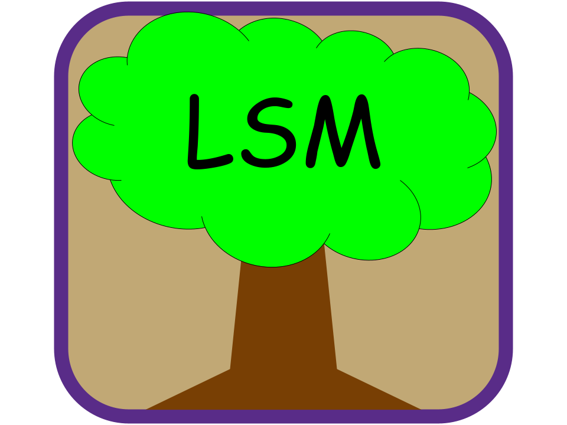

<h1 align="center">
     
        
     
        LSM Tree Education Application
      
</h1>

## Info
    CS 495: Capstone I
    Advisor: Dr. Holliday
    Author: Nolan Flinchum
    Version: 12/16/2023

## Description
    An LSM tree is a data structure with performance characteristics that make it very attractive
    to store date with more write intensive throughput. It uses a memory component and disk
    components to store data in a hierarchical manner.

    This project aims to create a web application to educate users on LSM trees. 

## Dependencies
    If this is your first time running the program, read the following:
    
    In the lsm/backend directory, run the command 
        `npm install` 
    to install dependencies needed to run the backend.
    
    In the lsm/frontend/lsm-app directory, run 
        `npm install` 
    to install dependencies needed to run the frontend.

## Usage
    To run the application, you'll need to use two separate terminals.
    
    Backend:
        In one terminal, navigate to the lsm/backend directory and run the command
            `npm start`
    
    Frontend:
        In the other terminal, navigate to the lsm/frontend/lsm-app directory and run the command
            `npm run dev`

## More Info
    This project is currently in development. 

## Questions?
    If you have any questions about this project, feel free to reach out

    Email: nolan@flinchum.net or ntflinchum1@catamount.wcu.edu
    Discord: nolantan
